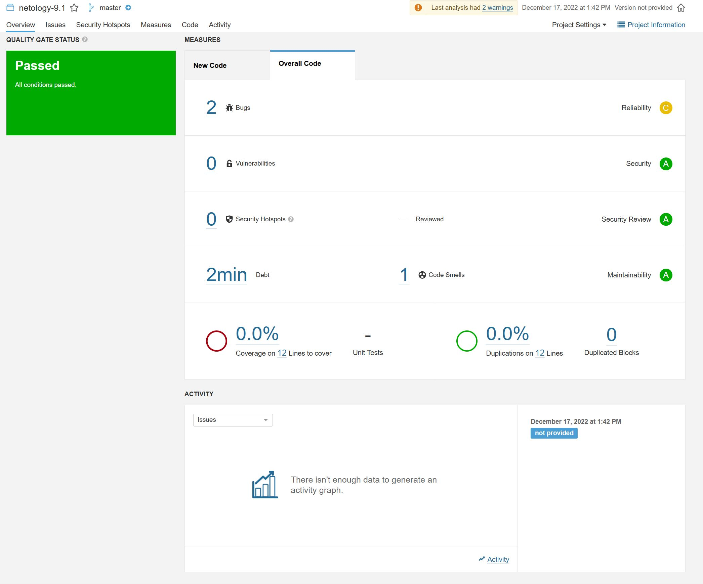

# DZ9.1-CI-CICD
# Домашнее задание к занятию "9.Процессы CI/CD"

## Подготовка к выполнению

1. Создаём 2 VM в yandex cloud со следующими параметрами: 2CPU 4RAM Centos7(остальное по минимальным требованиям)
2. Прописываем в [inventory](./infrastructure/inventory/cicd/hosts.yml) [playbook'a](./infrastructure/site.yml) созданные хосты
3. Добавляем в [files](./infrastructure/files/) файл со своим публичным ключом (id_rsa.pub). Если ключ называется иначе - найдите таску в плейбуке, которая использует id_rsa.pub имя и исправьте на своё
4. Запускаем playbook, ожидаем успешного завершения
5. Проверяем готовность Sonarqube через [браузер](http://localhost:9000)
6. Заходим под admin\admin, меняем пароль на свой
7.  Проверяем готовность Nexus через [бразуер](http://localhost:8081)
8. Подключаемся под admin\admin123, меняем пароль, сохраняем анонимный доступ

## Знакомоство с SonarQube

### Основная часть

1. Создаём новый проект, название произвольное
2. Скачиваем пакет sonar-scanner, который нам предлагает скачать сам sonarqube
3. Делаем так, чтобы binary был доступен через вызов в shell (или меняем переменную PATH или любой другой удобный вам способ)
4. Проверяем `sonar-scanner --version`

#### Ответ

```bash
root@vkvm:/home/vk/DZ9.3# sonar-scanner --version
INFO: Scanner configuration file: /root/sonar-scanner/sonar-scanner-4.7.0.2747-linux/conf/sonar-scanner.properties
INFO: Project root configuration file: NONE
INFO: SonarScanner 4.7.0.2747
INFO: Java 11.0.14.1 Eclipse Adoptium (64-bit)
INFO: Linux 5.15.0-56-generic amd64
```

5. Запускаем анализатор против кода из директории [example](./example) с дополнительным ключом `-Dsonar.coverage.exclusions=fail.py`
6. Смотрим результат в интерфейсе
7. Исправляем ошибки, которые он выявил(включая warnings)
8. Запускаем анализатор повторно - проверяем, что QG пройдены успешно
9. Делаем скриншот успешного прохождения анализа, прикладываем к решению ДЗ

### Ответ


[Исправленный файл](./fail.py)

## Знакомство с Nexus

### Основная часть

1. В репозиторий `maven-public` загружаем артефакт с GAV параметрами:
   1. groupId: netology
   2. artifactId: java
   3. version: 8_282
   4. classifier: distrib
   5. type: tar.gz
2. В него же загружаем такой же артефакт, но с version: 8_102
3. Проверяем, что все файлы загрузились успешно
4. В ответе присылаем файл `maven-metadata.xml` для этого артефекта

### Ответ

[Ссылка на maven-metadata.xml](./maven-metadata.xml)

### Знакомство с Maven

### Подготовка к выполнению

1. Скачиваем дистрибутив с [maven](https://maven.apache.org/download.cgi)
2. Разархивируем, делаем так, чтобы binary был доступен через вызов в shell (или меняем переменную PATH или любой другой удобный вам способ)
3. Удаляем из `apache-maven-<version>/conf/settings.xml` упоминание о правиле, отвергающем http соединение( раздел mirrors->id: my-repository-http-unblocker)
4. Проверяем `mvn --version`

```bash
root@vkvm:/home/vk/DZ9.3/mvn# mvn --version
Apache Maven 3.8.6 (84538c9988a25aec085021c365c560670ad80f63)
Maven home: /root/apache-maven-3.8.6
Java version: 11.0.17, vendor: Ubuntu, runtime: /usr/lib/jvm/java-11-openjdk-amd64
Default locale: en_US, platform encoding: UTF-8
OS name: "linux", version: "5.15.0-56-generic", arch: "amd64", family: "unix"
```

6. Забираем директорию [mvn](./mvn) с pom

### Основная часть

1. Меняем в `pom.xml` блок с зависимостями под наш артефакт из первого пункта задания для Nexus (java с версией 8_282)
2. Запускаем команду `mvn package` в директории с `pom.xml`, ожидаем успешного окончания

### Ответ

```bash
root@vkvm:/home/vk/DZ9.3/mvn# mvn package
[INFO] Scanning for projects...
[INFO] 
[INFO] --------------------< com.netology.app:simple-app >---------------------
[INFO] Building simple-app 1.0-SNAPSHOT
[INFO] --------------------------------[ jar ]---------------------------------
Downloading from my-repo: http://158.160.56.25:8081/repository/maven-public/netology/java/8_282/java-8_282.pom
[WARNING] The POM for netology:java:tar.gz:distrib:8_282 is missing, no dependency information available
Downloading from my-repo: http://158.160.56.25:8081/repository/maven-public/netology/java/8_282/java-8_282-distrib.tar.gz
Downloaded from my-repo: http://158.160.56.25:8081/repository/maven-public/netology/java/8_282/java-8_282-distrib.tar.gz (237 kB at 678 kB/s)
[INFO] 
..............................................................
WARNING] JAR will be empty - no content was marked for inclusion!
[INFO] Building jar: /home/vk/DZ9.3/mvn/target/simple-app-1.0-SNAPSHOT.jar
[INFO] ------------------------------------------------------------------------
[INFO] BUILD SUCCESS
[INFO] ------------------------------------------------------------------------
[INFO] Total time:  30.368 s
[INFO] Finished at: 2022-12-19T19:48:48+03:00
[INFO] ------------------------------------------------------------------------
```

4. Проверяем директорию `~/.m2/repository/`, находим наш артефакт

### Ответ

```bash
root@vkvm:/home/vk/DZ9.3/mvn# ls -l ~/.m2/repository/netology/java/8_282/
total 244
-rw-r--r-- 1 root root 236594 дек 19 19:48 java-8_282-distrib.tar.gz
-rw-r--r-- 1 root root     40 дек 19 19:48 java-8_282-distrib.tar.gz.sha1
-rw-r--r-- 1 root root    731 дек 19 19:48 java-8_282.pom.lastUpdated
-rw-r--r-- 1 root root    175 дек 19 19:48 _remote.repositories
```

6. В ответе присылаем исправленный файл `pom.xml`

### Ответ

[Ссылка на pom.xml](./pom.xml)

---

### Как оформить ДЗ?

Выполненное домашнее задание пришлите ссылкой на .md-файл в вашем репозитории.

---
